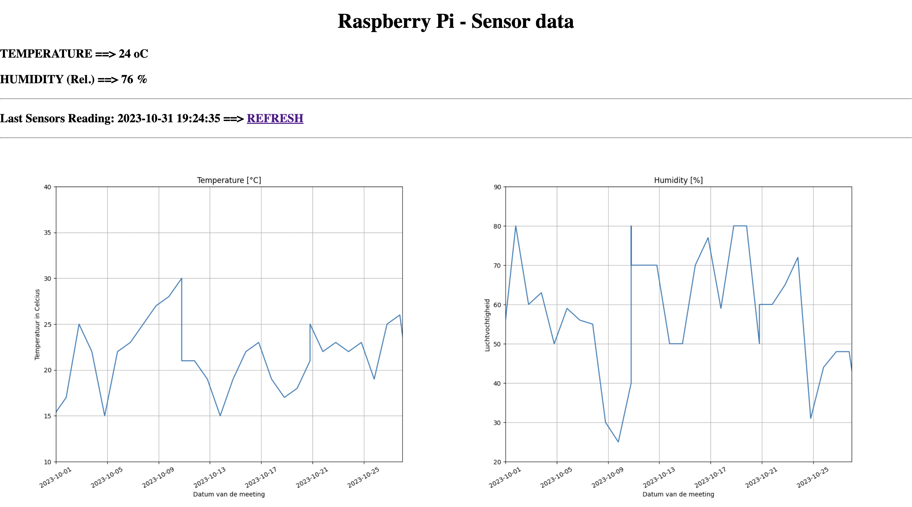

# service.sensor-data
Analyse and display sensory data of house temperature and humidity

## to do:
create readme
create drawio

### Introduction
The goal of this project was to analyze the temperature and humidity in house with a simple sensor and store this in a database. In addition an API was created which was called and then displayed the results on a webpage.

#### Design / setup of the project:

<!-- 

    

 -->

#### Starting date
Dec 28, 2021 backend
Jan 3, 2021 frontend

#### Context
We have some discussions at home about the temperature and humidity in house. To end the discussino ones and for all (😉) I decided to built my own sensor-pi combination and  store the data in database. Store the history enabled me to retrieve the data and show a trendline over the past days.

    

#### Tech and Tools
Flask API, DHT sensor, sqllite,
